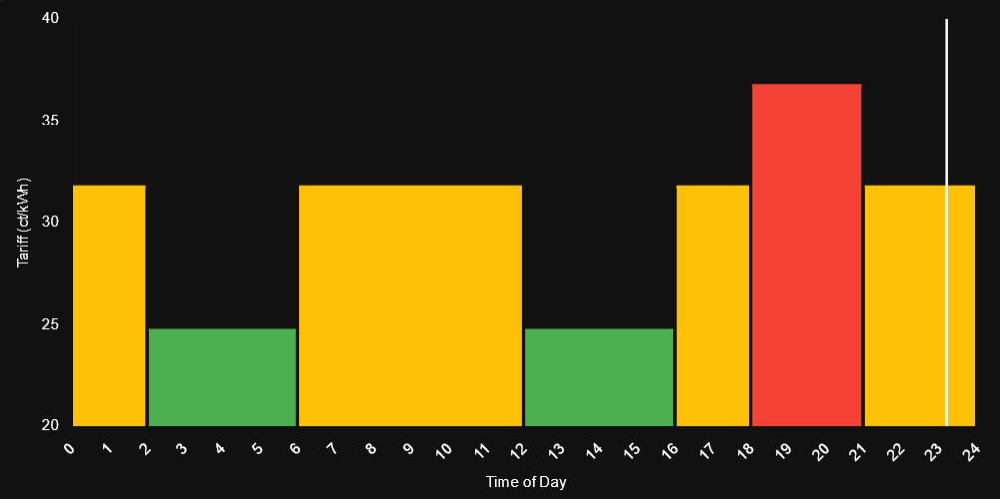

# Tariff Chart Card

A custom Home Assistant Lovelace card that displays tariff data with a dynamic chart. This card visualizes tariff zones and their prices, highlighting the current zone with a customizable line indicator.



---

## Features

- Visualize multiple tariff zones with time frames and prices.
- Highlight the current time zone dynamically.
- Fully responsive and configurable card size.

---

## Installation

### Option 1: Manual Installation

1. **Download the Files**:
   - Place the `tariff_chart.js` file in your Home Assistant's `www` directory.
   - Place the required Chart.js libraries:
     - `chart.js`
     - `chartjs-plugin-annotation.js`

     Example directory structure:
     ```
     /config/www/tariff_chart/
     ├── chartjs/chart.js
     ├── chartjs/chartjs-plugin-annotation.js
     ├── tariff_chart.js
     ```

2. **Add the Card to Lovelace Resources**:
   Go to **Settings > Dashboards > Resources**, and add:
   ```yaml
   url: /local/tariff_chart/tariff_chart.js
   type: module
   ```

3. **Restart Home Assistant**:
   Restart Home Assistant to load the new custom card.

### Option 2: Installation via HACS

1. **Add Custom Repository**:
   - Go to **HACS > Integrations > Custom Repositories**.
   - Add the URL of the repository hosting the `tariff_chart` files.
   - Select the category as **Frontend**.

2. **Install the Card**:
   - Search for `Tariff Chart Card` in HACS under the **Frontend** section.
   - Install the card.

3. **Add the Card to Lovelace Resources**:
   HACS should automatically add the resource, but verify it:
   ```yaml
   url: /hacsfiles/tariff_chart/tariff_chart.js
   type: module
   ```

4. **Restart Home Assistant**:
   Restart Home Assistant to ensure the card is loaded.

---

## Configuration

### Example Lovelace Configuration
```yaml
type: custom:tariff-chart-card
currentTimeLine:
  labelColor: "#000000"
tariffs:
  - name: Low Tariff
    value: 24.00
    timeFrames:
      - "02:00-06:00"
      - "12:00-16:00"
    color: "#00E5FF"
  - name: Medium Tariff
    value: 31.00
    timeFrames:
      - "00:00-02:00"
      - "06:00-12:00"
      - "16:00-18:00"
      - "21:00-24:00"
    color: "#FF9800"
  - name: High Tariff
    value: 36.00
    timeFrames:
      - "18:00-21:00"
    color: "#FF5252"
```

---

## Configuration Options

### Current Time Line
- **`labelColor`** (Optional):
  - Default: `"#000000"`
  - Description: Text color of the current time label.

### Tariffs
- **`tariffs`** (Required):
  - Description: Defines the tariff zones.
  - Each tariff requires:
    - **`name`**: Name of the tariff (e.g., Low Tariff).
    - **`value`**: Price of the tariff in `ct/kWh`.
    - **`timeFrames`**: Time ranges for the tariff (e.g., `"02:00-06:00"`).
    - **`color`**: Color for the tariff zone in the chart.

---

## Troubleshooting

1. **Card Not Found**:
   - Ensure the `tariff_chart.js` file is in the `/config/www/` directory.
   - Verify the resource URL is correctly added to Lovelace resources.

2. **Chart Not Displayed**:
   - Check if the required Chart.js libraries are in `/config/www/tariff_chart/chartjs/`.
   - Ensure the file names and paths match those in the configuration.

